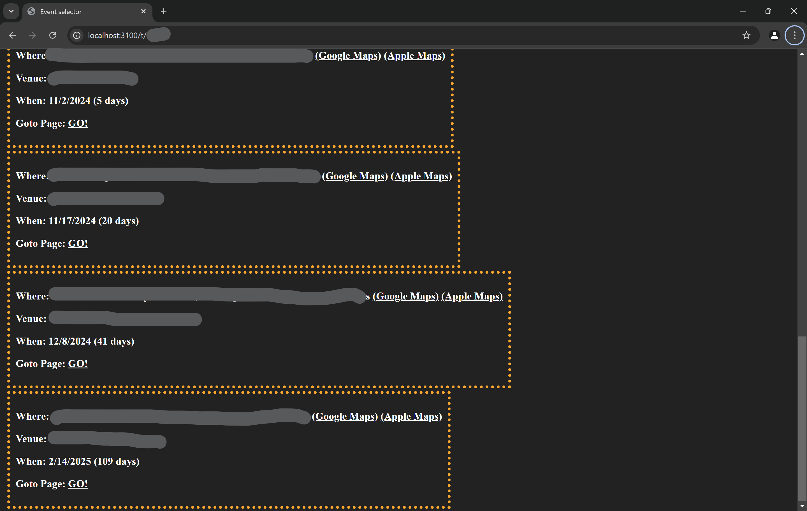

# Vex Scouting

An app designed to streamline scouting during a Vex robotics competitions!

- Server-Rendered HTML for "lightning-fast" speeds.
- Initially created during the 2023-2024 Vex game (Over Under) and **fully** compatible with the 2024-2025 game (High Stakes).
- Works Season after season without any* changes

⚠️ **Note: This app does not include a login page and is meant for on-site deployment only.**

🚀 *A public version with a login system is planned for release with version `2.5.0`.*

### Developer's Note
As a senior, this is my final year participating as a *Student* in Vex. However, I plan to remain involved and keep this project updated.

# 🔮 Futures

- Match View:
    - Streamlined interface for viewing matches.

- Note-Taking per Team:
    - Add and save notes specific to each team for better scouting and strategy planning.

- Custom Data Layout:
    - Flexibility to define and organize data layouts to suit preferences.

# 📷 Screenshots

# 📖 Help Resources

- [API Layout](/docs/apiRoutes.md)

- [How to](/docs/howTo.md)

- [Data Layout](/docs/layout.md)

- [Todo](/TODO.md)

# [🔖 Version History](./versions.md)

## 2.2.0

### 🌟 Enhancements
- ⭐ Added div selector! ⭐
- Renamed `times` to `matches` as it makes more sense
- Main page will now show `Team` and `Event` buttons
    - Plans coming to make the `Event` page a search page
    - Plans coming to make the `Team` page have a search
- Search Parameters:
    - Reformatted the team URL to use search parameters for cleaner links.
    - Added `div`, `shift`, and `team` as search parameters.
- Better Version notes
- Moved old [Versions](./versions.md)

### 🐞 Bug Fixes
- Fixed matches that are unscored showing a winning team
- Fixed the `Shift time` not working in the match viewer (done via the `shift` search param)

### 🛠️ Code Improvements
- Moved `/team` and `/event` to there own router files
- Added `User-Agent` to the axios request

### 🚧 Work in Progress
- WIP Session System (login system)

# 📨 Contact Me

Need help or want to connect? Message me on Discord: airplanegobrr