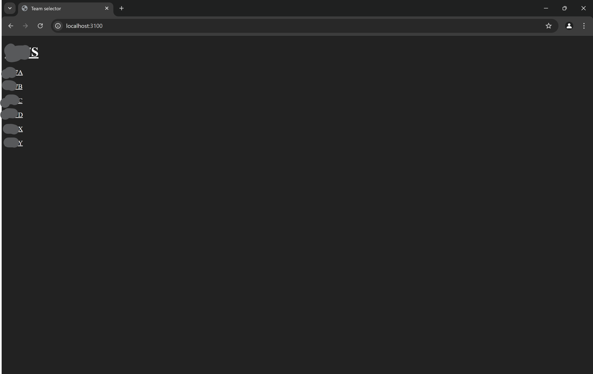
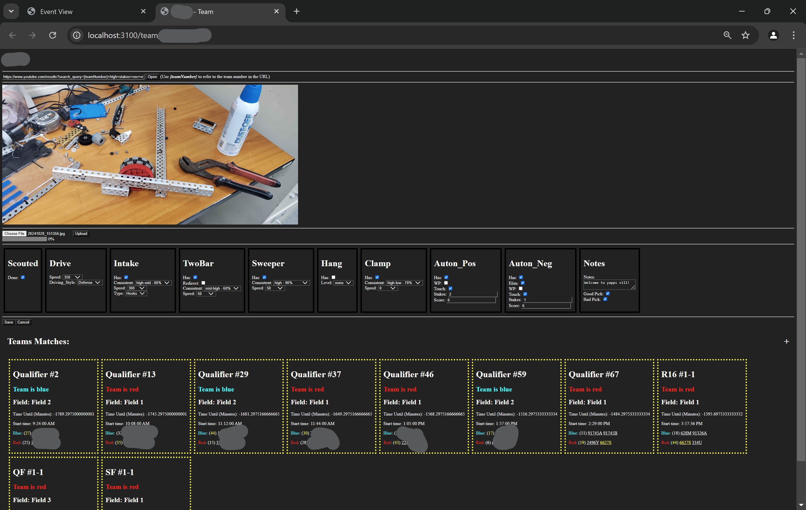

# Vex Scouting

This is an app that helps with scouting!

HTML is rendered on the server for FAST speeds!

This app was built for the 2023-2024 Vex game (Over Under)

**KEEP IN MIND THIS APP HAS NO LOGIN PAGE AND IS DESIGNED TO BE DEPLOYED ON SITE**

# Images

# Help!

[API Layout](/docs/apiRoutes.md)

[How to](/docs/howTo.md)

[Data Layout](/docs/layout.md)

[Todo](/TODO.md)

# Versions

# 2.0.0

2.0.0 is out! After along time of dreading, I did it!

**this breaks the 1.0.0 layouts! Old data will not load/work!**

- Replaced knex with quick.db (downgrade ngl)
- Remade data layout to be better and more expandable
- SSR (Server-Side-Rendering) is now being worked on, it's only used for the teams matches preview where SSR is used
- JS files can now be used for layouts
- A new `Table editor` is in the works! (planed to be done in `2.1.0`)