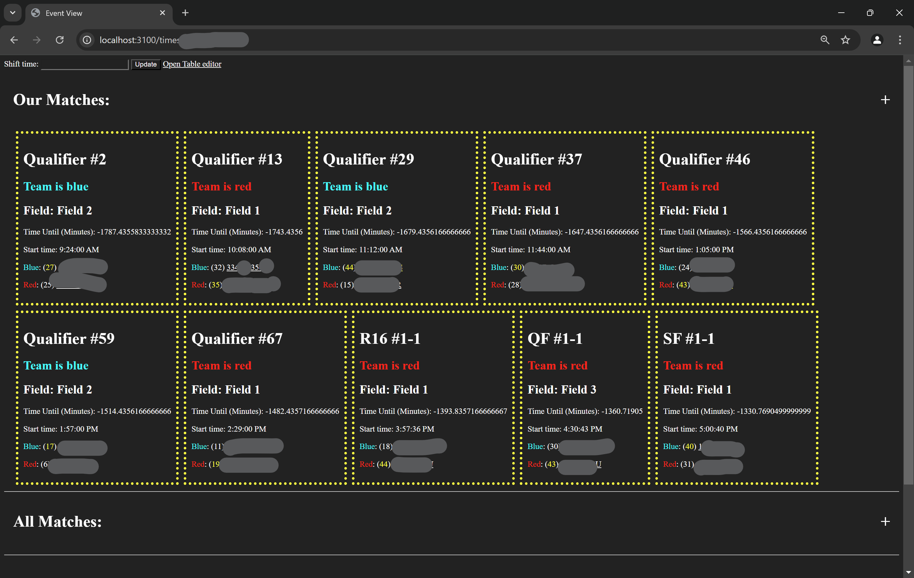

# READ!

Make sure you add the layout you want [here](/src/layout) Use the [example](/src/layout.example.json) move and rename it to `/src/layout/181.json`

`/src/layout/<seasonID>.json`

181 is the Season ID for `Over Under` (for VRC)

182 is the Season ID for `Over Under` (for VEX U)

# Main page (`/`)

This has the teams defined, the main teams will be bigger then teams

# Team page (`/t/<teamNumber>`)

This page has boxes about events that the team is signed up for

Each box has the following data:

Where: This is the address of the event, it was quick links to open Apple Maps or Google Maps

Venue: The Venue name

When: The Date of when the event is and then how long until the event starts/ended

Goto Page: Opens the page to see matches and other teams

# Event page (`/time/<eventID>/<divID>/<teamID>`)

This page has 3 drop down menus, Our Matchs, All Matches, and Teams

The `Our Matchs` has info about the teams matchs

At the top of the page you can enter a time (in minutes) to shift the times (if the event is running late or fast)

**For now you have to reload the page for the times to update**

It says what the name of the match is, what color you are and who your teammates are
It has the start time, this is how long utill the match starts

The `All matches` drop down is the same just with all the matches

The `Teams` drop down has all the teams with their links

**When clicking on any team it will open it in a new tab!**

# Scouting Team (`/team/<eventID>/<teamID>`)

This page has a picture of a robot, a upload picture button

Below is a few options and they are self explanatory

Below the settings there are the save and cancel buttons

The cancel button will just reload the page