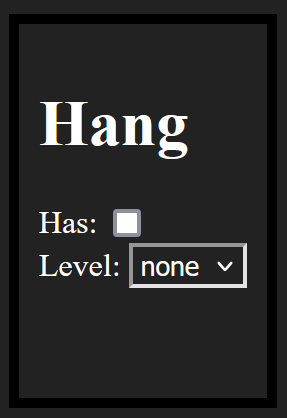

# Layout

Layouts can be a in `js` or in `json`

The layout is as follows:

```json
{
"<Section Name>": [
    { "type": "<HTML input type>", "name": "<label name>", "value": "done" }
],
"<Section Name2>": [
    { "type": "<HTML input type>", "name": "<label name>", "value": "done" }
],
}
```

The `<Section Name>` can be anything you want, I would avoid using spaces and replace them with `_` or `-`

Do **NOT HAVE** `.` as ANY of the names or values!!

Option types:
- checkbox
- select
- textbox

The `Name` is what will be shown, this is the "Label"

The `Value` is what it will be saved in as the database

How does `select` work? In the object make sure to add a second values array like so:
```json
[
    { "name":"none", "value": 0 },
    { "name":"1", "value": 1 },
    { "name":"2", "value": 2 },
    { "name":"3", "value": 3 }
]
```

So lets build a hang section!

```json
{
"Hang": [
        { "type": "checkbox", "name": "Has", "value": "has" },
        {
            "type": "select",
            "name": "Level",
            "value": "level",
            "values": [
                { "name":"none", "value": 0 },
                { "name":"1", "value": 1 },
                { "name":"2", "value": 2 },
                { "name":"3", "value": 3 }
            ]
        }
    ]
}
```

The output of this looks like so




in the `/src/layouts` folder place files with the season id and then file extention

The current Vex session ID is, `190`

If you wanted to use json the file would be `190.json`

for JS it would be `190.js`

Why JS? I added JS to allow you to make small scripts, maybe you would like a type that can be used across diff sections, you can do

```js
const fillers = {
    consistent: {
        type: "select",
        name: "Consistent",
        value: "consistent",
        values: [
            { name: "none", value: 0 },
            { name: "low - 10%", value: 10 },
            { name: "low-mid - 20%", value: 20 },
            { name: "low-high - 30%", value: 30 },
            { name: "mid-low - 40%", value: 40 },
            { name: "mid - 50%", value: 50 },
            { name: "mid-high - 60%", value: 60 },
            { name: "high-low - 70%", value: 70 },
            { name: "high-mid - 80%", value: 80 },
            { name: "high - 90%", value: 90 },
            { name: "god - 100%", value: 100 }
        ]
    }
}
```

This allows you to quickly use the `consistent` type across diff selections


Here is an `190.js` I made


```js
const fillers = {
    consistent: {
        type: "select",
        name: "Consistent",
        value: "consistent",
        values: [
            { name: "none", value: 0 },
            { name: "low - 10%", value: 10 },
            { name: "low-mid - 20%", value: 20 },
            { name: "low-high - 30%", value: 30 },
            { name: "mid-low - 40%", value: 40 },
            { name: "mid - 50%", value: 50 },
            { name: "mid-high - 60%", value: 60 },
            { name: "high-low - 70%", value: 70 },
            { name: "high-mid - 80%", value: 80 },
            { name: "high - 90%", value: 90 },
            { name: "god - 100%", value: 100 }
        ]
    },
    speeds: {
        start: 0,
        end: 1000,
        step: 50,
        type: "select",
        name: "Speed",
        value: "speed"
    }
}

for (let elm in fillers) {
    let info = fillers[elm]
    if ('start' in info && 'end' in info && 'step' in info) {
        info.values ??= []
        for (let index = info.start; index <= info.end; index+=info.step) {
            info.values.push({ name: index, value: index })
        }
    }
}

module.exports = {
    Scouted: [
        { type: "checkbox", name: "Done", value: "done" }
    ],
    Drive: [
        fillers.speeds,
        {
            type: "select",
            name: "Driving_Style",
            value: "style",
            values: [
                { name: "none", value: 0 },
                { name: "Defense", value: 1},
                { name: "Offense", value: 2},
            ]
        }
    ],
    Intake: [
        { type: "checkbox", name: "Has", value: "has" },
        fillers.consistent,
        fillers.speeds,
        {
            type: "select",
            name: "Type",
            value: "type",
            values: [
                { name:"none", value: 0 },
                { name:"Hooks", value: 1 },
                { name:"Flex", value: 2 },
                { name:"Flaps", value: 3 },
                { name:"Other", value: 10 },
            ]
        }
    ],
    TwoBar: [
        { type: "checkbox", name: "Has", value: "has" },
        { type: "checkbox", name: "Redirect", value: "redirect" },
        fillers.consistent,
        fillers.speeds
    ],
    Sweeper: [
        { type: "checkbox", name: "Has", value: "has" },
        fillers.consistent,
        fillers.speeds
    ],
    Hang: [
        { type: "checkbox", name: "Has", value: "has" },
        {
            type: "select",
            name: "Level",
            value: "level",
            values: [
                { name:"none", value: 0 },
                { name:"1", value: 1 },
                { name:"2", value: 2 },
                { name:"3", value: 3 }
            ]
        }
    ],
    Clamp: [
        { type: "checkbox", name: "Has", value: "has" },
        fillers.consistent,
        fillers.speeds
    ],
    Auton_Pos: [
        { type: "checkbox", name: "Has", value: "has" },
        { type: "checkbox", name: "WP", value: "wp" },
        { type: "checkbox", name: "Touch", value: "touch" },
        { type: "number", name: "Stakes", value: "stakes" },
        { type: "number", name: "Score", value: "score" }
    ],
    Auton_Neg: [
        { type: "checkbox", name: "Has", value: "has" },
        { type: "checkbox", name: "Elim", value: "elim" },
        { type: "checkbox", name: "WP", value: "wp" },
        { type: "checkbox", name: "Touch", value: "touch" },
        { type: "number", name: "Stakes", value: "stakes" },
        { type: "number", name: "Score", value: "score" },
    ],
    Notes: [
        { type: "textbox", name: "Notes", value: "notes" },
        { type: "checkbox", name: "Good Pick", value: "pickGood" },
        { type: "checkbox", name: "Bad Pick", value: "pickBad" },
    ]
}
```